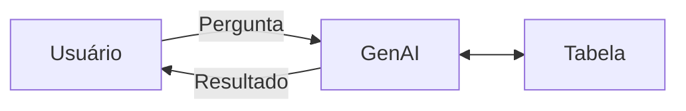

<h1 align="center">
CESPUB GenAI
</h1>

    
    

<a href="#sobre-o-projeto">Sobre o Projeto</a> •
<a href="#sobre-o-cliente">Sobre o Cliente</a> •
<a href="#equipe-técnica">Equipe Técnica</a> •
<a href="#licença">Licença</a>

<b>Decision Intelligence</b>

---

<b>Tempo estimado:</b> 3 semanas

<b>Data de ínicio: 12/03/2025</b> |
<b>Data de finalização: Em desenvolvimento</b>

---

- Board de atividades: [Planner](https://planner.cloud.microsoft/webui/plan/8R7zsF8fG0i6HQxbJ54n42QAGHKR/view/board?tid=26c14496-9556-43db-8169-202c0c793d4d)
- Especificação do Projeto: [Proposta CESPUB](https://scientificloud01.sharepoint.com/sites/CESPUBGenAI/Documentos%20Compartilhados/Forms/AllItems.aspx?id=%2Fsites%2FCESPUBGenAI%2FDocumentos%20Compartilhados%2FCESPUB%20%2D%20Proposta%20Claudinho%20%2D%20tecnica%201%2Epdf&parent=%2Fsites%2FCESPUBGenAI%2FDocumentos%20Compartilhados)
- Documentação: [Documentação WrenAI](https://github.com/s-c-ai/CESPUB-GenAI/blob/main/OLD_README.md)

---

## Sobre o Projeto

Viabilizar análises e criação de insights a partir de dados de editais passados.

**Tipos de resultado**: Texto, gráfico e tabela.

### Desafio

Atender diferentes públicos - diretoria, área comercial e analistas da engenharia de valor - para criar análises e insights que se adequem ao perfil de cada usuário.

### Motivação

Utilizar Inteligência Artificial Generativa (GenAI) para acelerar o perfil analítico de usuários com diferentes níveis de entendimento e acesso à informação desejada.

O projeto visa democratizar o acesso a análises e insights utilizando a flexibilidade da GenAI para trazer respostas rápidas e concisas, podendo reunir diferentes usuários em uma aplicação.

## Sobre o Cliente [WIP]

WIP

## Equipe Técnica

<table>
  <tr>
    <td align="center">
      <a href="https://www.linkedin.com/in/kalatalo/">
         
        
          <b>Luciano Kalatalo</b>
        
      </a>
    </td>
    <td align="center">
      <a href="https://www.linkedin.com/in/richardwallan/">
         
        
          <b>Richard Wallan</b>
        
      </a>
    </td>
    <td align="center">
      <a href="https://www.linkedin.com/in/nor-mustafa/">
         
        
          <b>Nor Mustafa</b>
        
      </a>
    </td>
  </tr>
</table>

## Licença

Todos os direitos reservados à [ScientifiCloud](https://s-c.ai).
